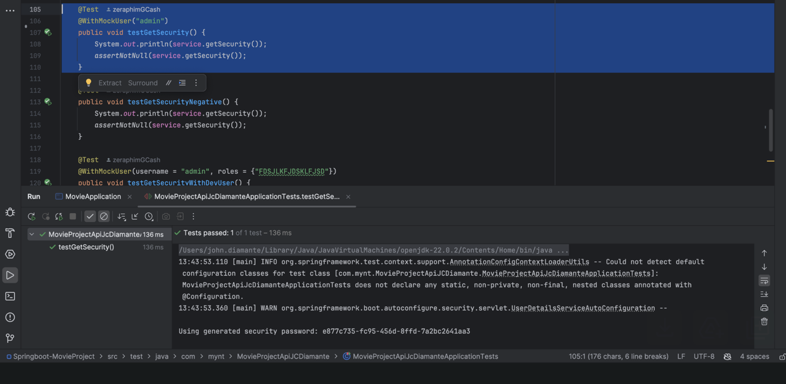
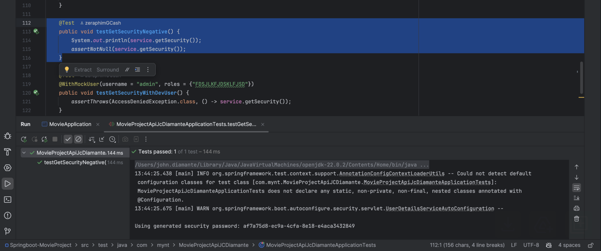
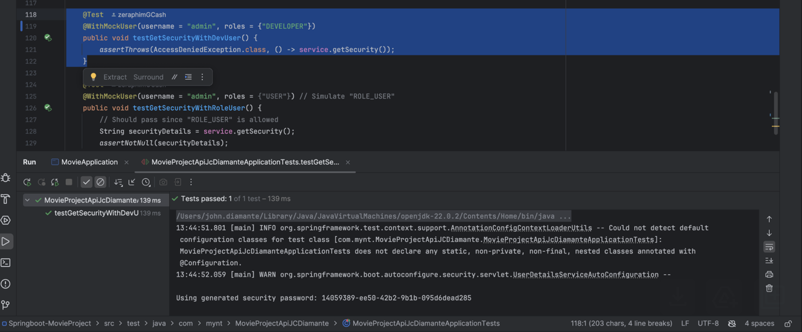
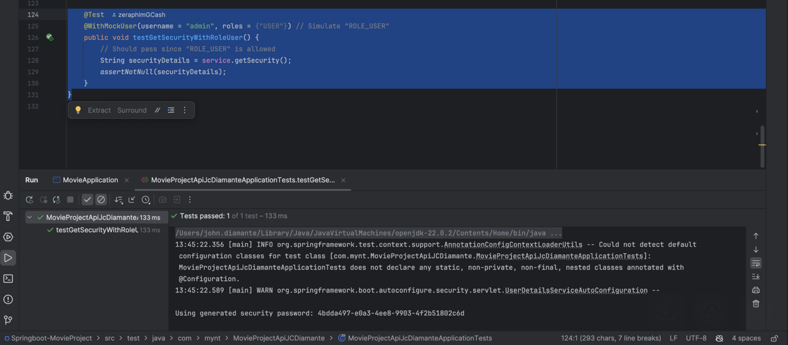

# Movie Project API
by: John Christian Diamante

# ⚒️ Setup
1. Open the project using **IntelliJ**
2. Access `localhost:8080` in the browser
   http://localhost:8080/
3. Open another tab and access **H2 Console** -> Login with *username* and *password*
4. Open the link http://localhost:8080/h2-console/
5. Once logged in, enter the SQL query found in the `SQL_Queries` folder inside the package in java folder.

# ✅ Test Cases

Outputs
1. testGetSecurity() with MockUser [PASSED]

2. testGetSecurityNegative() [PASSED]

3. testGetSecurityWithDevUser() [PASSED]

4. testGetSecurityWithRoleUser() [PASSED]

